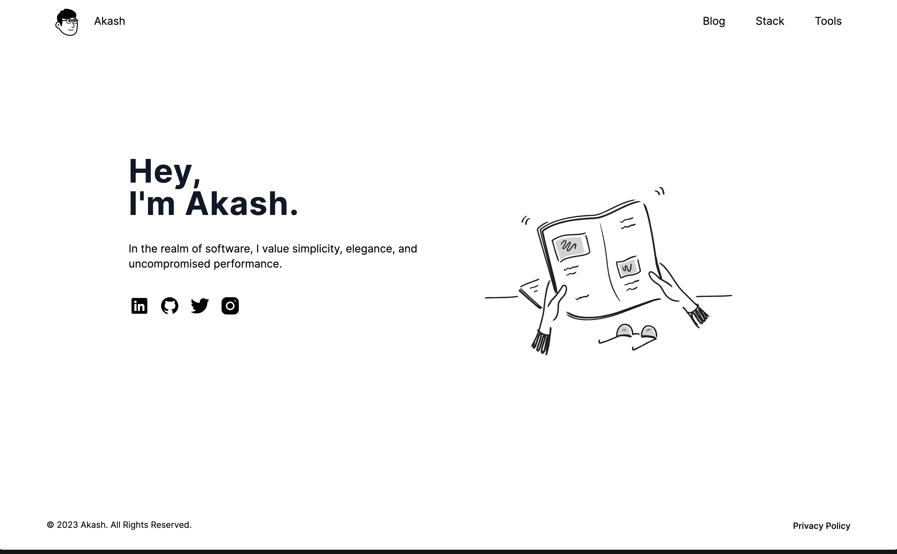
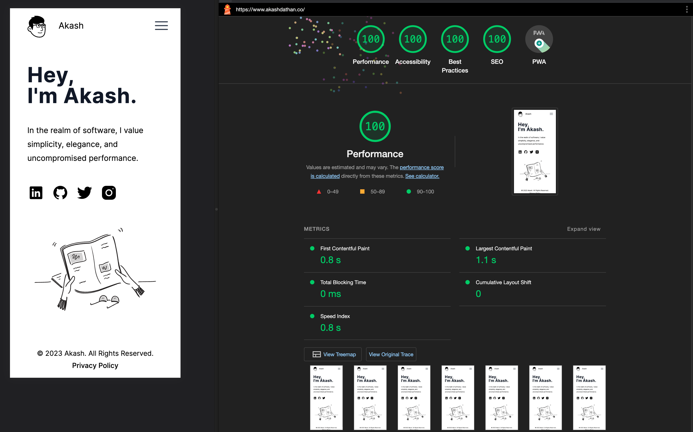
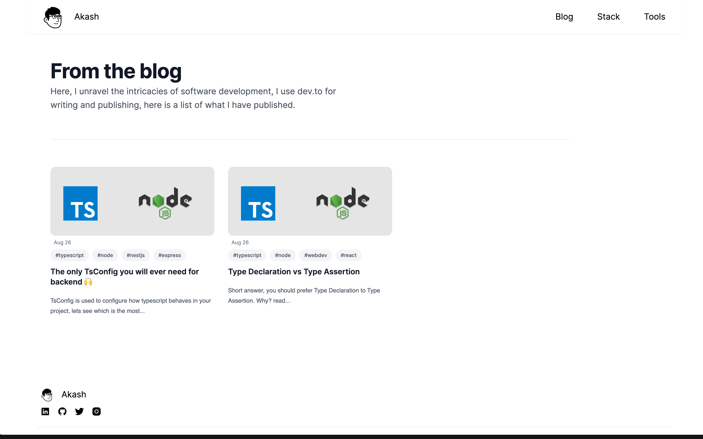

<a href="https://akashdathan.co">
  

  <h1 align="center">Minimalistic Portfolio</h1>
</a>

<p align="center">
  Notion inspired minimalistic portfolio using NextJS and TailwindCSS
</p>

<p align="center">
  <a href="https://twitter.com/akash_dathan">
    
  </a>
  <a href="https://github.com/akashdathan/portfolio">
    
  </a>
</p>

<p align="center">
  <a href="#introduction"><strong>Introduction</strong></a> ·
  <a href="#one-click-deploy"><strong>One-click Deploy</strong></a> ·
  <a href="#tech-stack--features"><strong>Tech Stack + Features</strong></a> ·
  <a href="#author"><strong>Author</strong></a>
</p>
<br/>

## Introduction

This is the code for a minimalistic notion inspired portfolio, feel free to fork it or create a PR to improve it.

## One-click Deploy

You can deploy this template to Vercel with the button below:

[](https://vercel.com/new/clone?repository-url=https%3A%2F%2Fgithub.com%2Fakashdathan%2Fportfolio&project-name=minimalistic-portfolio&repository-name=minimalistic-portfolio&demo-title=Minimalistic%20Portfolio&demo-description=Notion%20Inspired%20Minimalistic%20Portfolio%20Usinfg%20NextJS%20%26%20TailwindCSS&demo-url=https%3A%2F%2Fakashdathan.co&demo-image=https%3A%2F%2Fakashdathan.co%2Fimages%2Fdemo-image.png)

You can also clone & create this repo locally with the following command:

```bash
npx create-next-app portfolio --example "https://github.com/akashdathan/portfolio"
```

## Tech Stack + Features

<p align="center">
    
    
<p>

- Minimalistic Home Screen 
- Blog section lists the articles published on [dev.to](https://www.dev.to)
- Perfect Lighthouse Score
- Custom 404 Page
- Uses NextJS with Typescript and TailwindCSS
- [Notion Avatar Maker](https://notion-avatar.vercel.app/) to generate notion style avatar
- [favicon.io](https://favicon.io/) to generate favicons

## Author

- Akash Dathan ([@akash_dathan](https://twitter.com/akash_dathan))