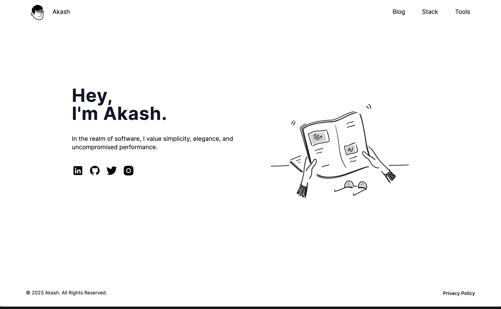
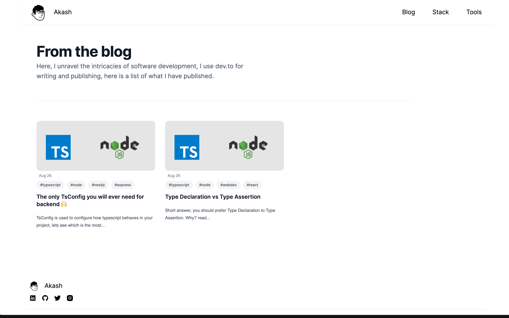

# Notion Inspired Minimalistic Portfolio

This is the code for my personal portfolio, feel free to fork it or create a PR to improve it.

Blog section lists the articles published on [dev.to](dev.to)

### [akashdathan.co](https://next-blog-contentful.vercel.app/)

## Home Page

## Blog

## Tools Used

- [Notion Avatar Maker](https://notion-avatar.vercel.app/) to generate notion style avatar
- [favicon.io](https://favicon.io/) to generate favicons